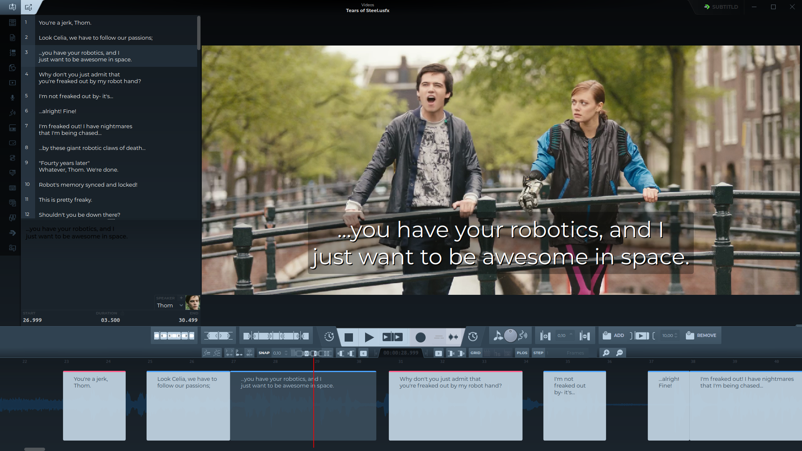
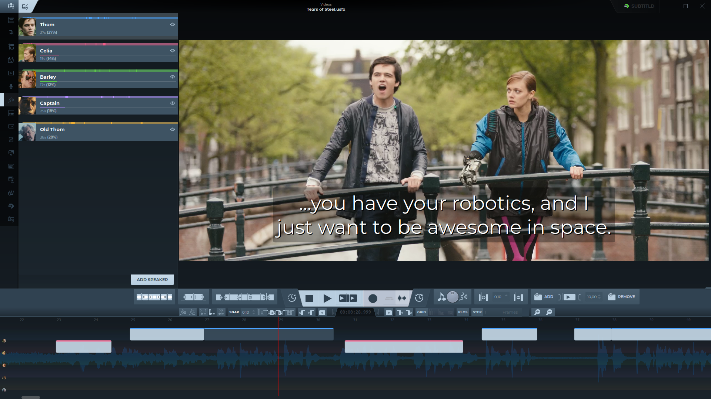
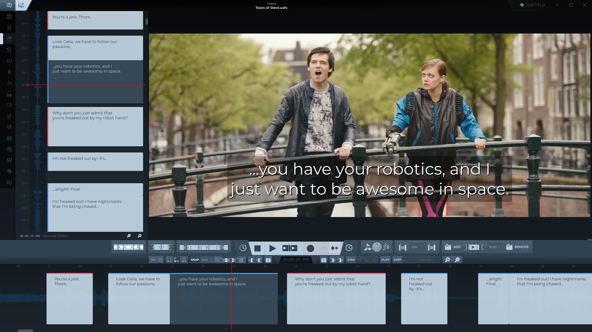

<p align="center">
  
</p>

<p align="center">
  <b>A free and open source subtitle editor for Linux, Windows, macOS and Haiku.</b><br>
  Time subtitles on the waveform, transcribe and translate them with engines that can run on
  your own machine, and dub them with synthetic voices.
</p>

<p align="center">
  <a href="https://github.com/Subtitld/subtitld/actions/workflows/ci.yml"></a>
  <a href="https://snapcraft.io/subtitld"></a>
  <a href="https://flathub.org/apps/org.subtitld.Subtitld"></a>
  <a href="https://aur.archlinux.org/packages/subtitld"></a>
  <a href="https://pypi.org/project/subtitld/"></a>
  <a href="LICENSE"></a>
  <a href="https://discord.gg/XjZ9AJAgU"></a>
</p>

<p align="center">
  <a href="#install">Install</a> ·
  <a href="#features">Features</a> ·
  <a href="#add-ons">Add-ons</a> ·
  <a href="#formats">Formats</a> ·
  <a href="#run-from-source">Run from source</a> ·
  <a href="https://subtitld.org">Website</a> ·
  <a href="https://discord.gg/XjZ9AJAgU">Discord</a>
</p>



## Features

### ⏱️ Timing on the waveform
- A timeline with the audio's waveform: drag a subtitle to move it, drag its edges to retime it.
- Snapping to the neighbouring subtitles and to a grid of frames or seconds, with zoom for fine work.
- A vertical timeline beside the list, for working down the subtitles.
- Set a subtitle's start or end to the playhead, slice it in two, merge it with its neighbour, nudge it by a step.
- A quality check against reading speed (characters per second, words per minute), duration, line count and line length, with the usual limits as defaults.

### 🎬 Video and audio
- The video with the current subtitle drawn over it, as it will be seen, with safe-area guides.
- Playback speed, looping and frame stepping.
- A mixer for the video's sound and the dubs, with EQ, compressor and gate per track.
- 4K and 8K videos get a lighter proxy to edit with, made on the GPU where there is one.

### 🗣️ Speakers
- Name the speakers and give them a face from the video; each one gets a colour, and a lane of their own on the timeline if you like.
- See how long each one speaks.

### 🤖 Transcription, translation and dubbing
- **Transcribe** the video's speech into timed subtitles: all of it, a range, or the selection. Or speak into the microphone and watch it become subtitles.
- **Translate** the subtitles, keeping each language's translation alongside the original.
- **Dub**: speak every subtitle with a synthetic voice, one voice per speaker. Dubs can be fitted to each subtitle's duration, and voices that clone take their sample from the video. Or record your own voice instead.
- Export the dub as WAV, FLAC or MP3: the whole mix, a track per speaker, the clips, or the background or the voices alone.
- Transcription and translation engines, and more voices, are [add-ons](#add-ons), many of them fully offline. Two online voices (Edge and Google) come built in.

### ✍️ Editing
- Undo, find and replace (with regular expressions), autosave and backups.
- A plain-text view to edit all the subtitles as one document, as SRT, Markdown or JSON.
- Keyboard shortcuts, which you can change.
- Recent files reopen where you left off.
- Import a transcript from a text or Word file, sliced into subtitles.

### 🌐 subtitld.cc
[subtitld.cc](https://subtitld.cc) is Subtitld's community hub. When a video opens, Subtitld can
look up subtitles made for that exact file (it sends a fingerprint, never the video or its name).
You can also search, rate and open subtitles there, and publish your own, all from inside the app.

<table>
  <tr>
    <td width="50%"></td>
    <td width="50%"></td>
  </tr>
  <tr>
    <td align="center"><sub>Speakers, each on a track of their own</sub></td>
    <td align="center"><sub>The vertical timeline</sub></td>
  </tr>
</table>

<sub>Screenshots: <a href="https://mango.blender.org">Tears of Steel</a>, © Blender Foundation, CC BY 3.0.</sub>

## Install

| | |
|---|---|
| **Linux** | <a href="https://snapcraft.io/subtitld"></a> <a href="https://flathub.org/apps/org.subtitld.Subtitld"></a><br>Arch Linux: [`subtitld`](https://aur.archlinux.org/packages/subtitld) on the AUR · Any distribution: the AppImage from [builds.subtitld.org](https://builds.subtitld.org) |
| **Windows** | <a href="https://apps.microsoft.com/detail/9MXLZSL8JPQH"></a><br>Or the installer, or the portable version, from [builds.subtitld.org](https://builds.subtitld.org) |
| **macOS** | With Python, [from PyPI](#from-pypi) |
| **Haiku** | Coming to HaikuPorts; the recipes are in [`packaging/haiku`](packaging/haiku) |

### From PyPI

On any system with Python 3.10 to 3.14 and [FFmpeg](https://ffmpeg.org) on the `PATH`:

```bash
pip install subtitld
subtitld
```

On Linux, the audio also needs PortAudio (`libportaudio2` on Debian and Ubuntu).

## Add-ons

Speech recognition, translation, more voices and audio separation come as add-ons, installed
from inside Subtitld (**Add-ons** in the global settings). Each one brings its own models, so the
app stays small and you only download what you use.

| | Add-ons |
|---|---|
| **Speech to text** | [whisper.cpp](https://github.com/Subtitld/addon-whispercpp) (offline) · [Vosk](https://github.com/Subtitld/addon-vosk) (offline) · [RealtimeSTT](https://github.com/Subtitld/addon-realtimestt) (offline, as you speak) · [AssemblyAI](https://github.com/Subtitld/addon-assemblyai) (cloud) |
| **Translation** | [Offline translation](https://github.com/Subtitld/addon-translate-offline) (OPUS-MT models, no API key) |
| **Voices** | [Piper](https://github.com/Subtitld/addon-piper-tts) · [Kokoro](https://github.com/Subtitld/addon-kokoro) · [Supertonic](https://github.com/Subtitld/addon-supertonic) · [sanoTTS](https://github.com/Subtitld/addon-sanotts) · [Parler-TTS](https://github.com/Subtitld/addon-parler-tts) · with voice cloning: [Qwen3-TTS](https://github.com/Subtitld/addon-qwen3-tts), [Coqui XTTS](https://github.com/Subtitld/addon-coqui-xtts) and [F5-TTS](https://github.com/Subtitld/addon-f5-tts) |
| **Audio** | [Audio separator](https://github.com/Subtitld/addon-audio-separator): split the voices from the music and effects |

The list Subtitld shows comes from [Subtitld/addons-catalog](https://github.com/Subtitld/addons-catalog).
Some models are for non-commercial use only; each add-on's page says which.

## Formats

| | |
|---|---|
| **Open and save** | SubRip (`.srt`) · WebVTT (`.vtt`) · TTML (`.ttml`) · DFXP (`.dfxp`) · SAMI (`.smi`, `.sami`) · Scenarist (`.scc`) · JSON · Universal Subtitle Format (`.usf`) |
| **Open** | SubStation Alpha (`.ass`, `.ssa`; the text, not the styles) · MicroDVD (`.sub`) · iTunes Timed Text (`.itt`) · XML |
| **Projects** | `.usfx`: the subtitles bundled with the speakers' faces and dubs, and, if you choose, the waveform and the video |
| **Transcripts** | Import from `.txt`, `.docx` and `.srt` |
| **Video** | MP4, MKV, MOV, WebM, MPEG, Ogg and M4V, through FFmpeg |
| **Dub** | WAV, FLAC, MP3 |

## Run from source

You need Python 3.10 to 3.14, FFmpeg, and on Linux PortAudio.

```bash
git clone https://github.com/Subtitld/subtitld.git
cd subtitld
python3 -m venv .venv
.venv/bin/pip install -e .
.venv/bin/subtitld
```

### Tests

Each test is a script that runs Qt off-screen, with its own scratch settings:

```bash
for t in tests/test_*.py; do .venv/bin/python "$t" || echo "FAILED: $t"; done
```

### Packaging

Every package is built by CI from this repository:
[`build.yml`](.github/workflows/build.yml) builds them all without publishing, and
[`release.yml`](.github/workflows/release.yml) publishes them on a version tag.

| Package | Where it's defined |
|---|---|
| Wheel (PyPI) | [`pyproject.toml`](pyproject.toml) |
| AppImage | [`AppImageBuilder.yml`](AppImageBuilder.yml) |
| Snap | [`snap/snapcraft.yaml`](snap/snapcraft.yaml) |
| Flatpak | [`flatpak/`](flatpak) |
| AUR | [`packaging/aur/`](packaging/aur) |
| Windows: installer, portable, Microsoft Store | [`nsis-installer.nsi`](nsis-installer.nsi) · [`packaging/msix/`](packaging/msix) · [`subtitld-windows.spec`](subtitld-windows.spec) |
| macOS app | [`subtitld-macos.spec`](subtitld-macos.spec) |
| Haiku | [`packaging/haiku/`](packaging/haiku) |

The icons, installer pictures and this page's banner are drawn from two SVGs by
[`packaging/branding/render-icons.py`](packaging/branding/render-icons.py).

## Contributing

Bugs and ideas go in the [issues](https://github.com/Subtitld/subtitld/issues); pull requests are
welcome. For questions, help, or just to talk subtitles, join us on
[Discord](https://discord.gg/XjZ9AJAgU). If Subtitld is useful to you, you can also [support its development](https://subtitld.org).

## License

Subtitld is free software, released under the [GNU General Public License v3.0](LICENSE).
